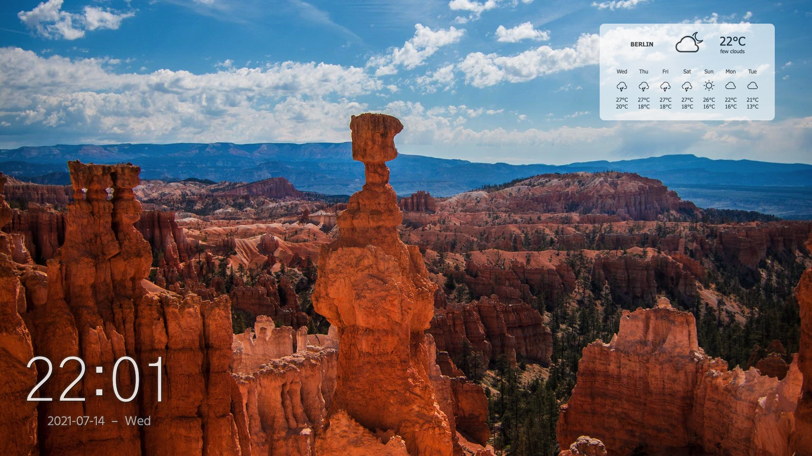
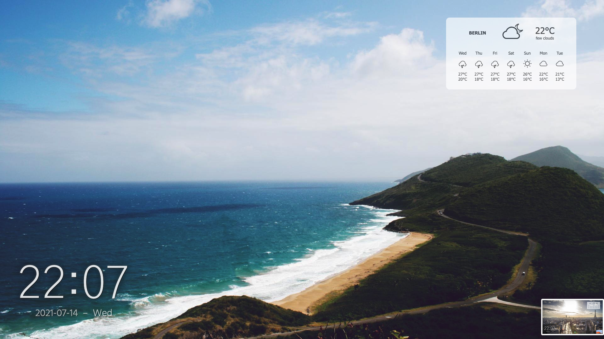
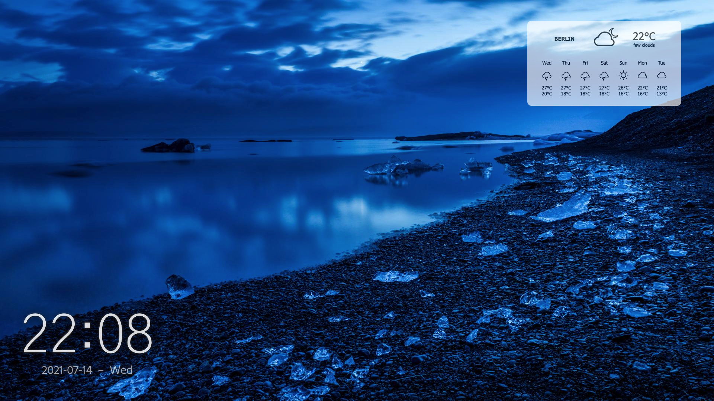

# Simple New Tab Page

Preview: https://jakobjjw.github.io/home.html

  

- Loads a random wallpaper image from unsplash.it
- Displays the time and date (and updates it)
- Displays weather information from weatherwidget.io (source code can be adjusted to update location)

Source: https://github.com/jakobjjw/jakobjjw.github.io

Uses jQuery and Google Web Fonts  
License: MIT
